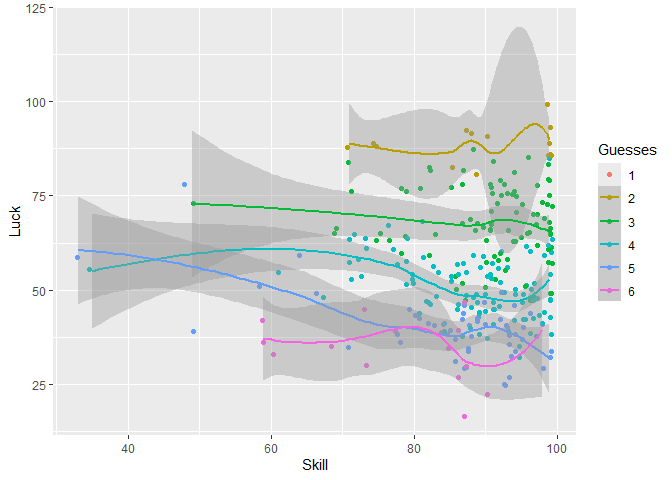
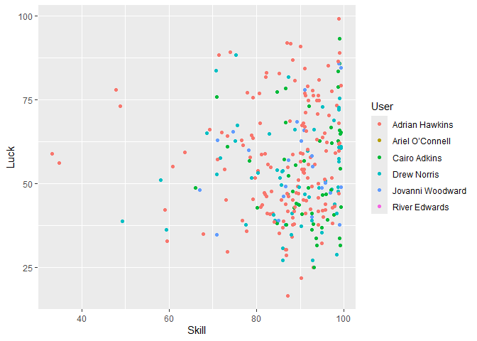
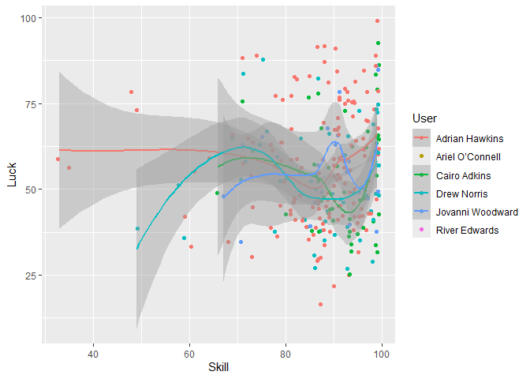

Better to be Lucky than Good? A Wordle Analysis
================

## Introduction

In the rapidly growing landscape of online word games,
[Wordle](https://www.nytimes.com/games/wordle/index.html) has emerged as
a popular and engaging daily challenge that tests players’ vocabulary,
deduction, and strategy. The objective is simple: guess a hidden
five-letter word within six attempts, using color-coded feedback to
inform subsequent guesses. While success in Wordle might seem to hinge
on a combination of vocabulary breadth and strategic reasoning, this
study investigates a less intuitive factor—luck.

This analysis explores the relative contributions of luck and skill to
Wordle performance. Using a dataset of Wordle games, we employ an
R-based analysis to measure how each player’s skill and luck scores
correlate with the number of guesses required to solve the puzzle.

## Methods

The data for this study is drawn from a Facebook messenger chat between
college friends. This chat contains shared Wordle results dating back to
March 2022. A data request was made to Facebook to download the entire
chat in HTML so that messages containing Wordle results could be
extracted. The consent of all parties who shared the results of scored
Wordle games between March 2022 and August 2024 was obtained prior to
publication. This study was exempted from IRB review by not being
submitted to an IRB.

Analysis was performed in R 4.4.1 using the code below. A total of 2297
observations were extracted from the chat, of which 279 had valid Skill,
Luck, and Guess data. To speed up analysis of data with regex, the
analysis was conducted on Northwestern University’s Quest HPC Cluster
using parallel computing methods.

## Analysis

First we load the necessary libraries. We then import the group chat
data from a file called `message_1.html`. This raw source data is not
shared on GitHub to maintain privacy of group member communications.

``` r
# Load necessary libraries
library(rvest)
library(dplyr)
library(magrittr)
library(stringr)
library(future)
library(furrr)
library(ggplot2)
library(tidyr)
library(lubridate)

# Load the HTML file

on.hpc = FALSE

if(on.hpc){
  file_path = "message_1.html"
} else {
  file_path <- "C:\\Users\\saiee\\OneDrive\\Documents\\_Northwestern Residency\\Research\\Miscellaneous Analyses\\message_1.html" #URL on PC
}

page <- read_html(file_path)

# Extract the text content from the HTML
text_content <- page %>% html_text()

# Split the text content into individual lines
lines <- str_split(text_content, "(?=Wordle )") %>% .[[1]]

# Loop through each line to find and extract Wordle data
params <- list('i' = seq(2,length(lines)))
```

We then create a function `calc_row` for examining a single line of html
from the chat. This function assesses whether the line contains a Wordle
post. If it does, then it extracts that Wordle data and create a row of
data summarizing the Wordle post. If not, it returns an NA row.

``` r
calc_row <- function(i) {
  line <- str_trim(lines[i]) %>% {sub(',','',.)}
  
  # Check if the line contains a Wordle result
  if (str_detect(line, "\\d+ \\d/6")) {
    # Extract the Wordle number, guesses, and user
    wordle_number <- str_extract(line, "Wordle \\d+") %>% str_extract("\\d+") %>% as.numeric()
    guess <- str_extract(line, "\\d/6") %>% str_extract("\\d") %>% as.numeric()
    user <- word(lines[i-1],-1)

    # Find the WordleBot skill and luck scores in the following lines
    skill <- str_extract(line, "Skill \\d+/99") %>% str_extract("\\d+") %>% as.numeric()
    luck <- str_extract(line, "Luck \\d+/99") %>% str_extract("\\d+") %>% as.numeric()
    
    # Extract the date from two lines above the Wordle result
    date <- str_trim(line) %>% str_extract("[A-Za-z]{3} \\d{1,2}, \\d{4}")

    wordle_data <- data.frame(
      'Date' = date,
      'User' = user,
      'Wordle' = wordle_number,
      'Guesses' = guess,
      'Skill' = skill,
      'Luck' = luck,
      stringsAsFactors = FALSE
    )
  } else {
    wordle_data <- data.frame(
      'Date' = NA,
      'User' = NA,
      'Wordle' = NA,
      'Guesses' = NA,
      'Skill' = NA,
      'Luck' = NA,
      stringsAsFactors = FALSE
    )
  }
  
  return(wordle_data)
  
  
}
```

The next chunk plans and executes the parallel computing process using
library functions from the `furrr` package. The code runs `calc_row` on
each line of text, collects the results as a list of N 1x6 data frames,
and combines the rows to make an Nx6 data frame and saves the data to a
CSV file.

``` r
plan(multicore, workers = 3)
wordle <- future_pmap(params, calc_row, .progress = TRUE) %>%
  bind_rows()

# now save the data to a csv

write.csv(wordle, file = 'wordle_data.csv')
```

We then clean the data. Data cleaning steps are explained in in-line
comments.

``` r
# Some 'users' identified in calc_row(...) are actually just random words.
# Here I extract names of real users on the basis that their names are 
# capitalized. I could have hard-coded vector of my friends' names,
# e.g., c('Alex','Hector', etc.), but I am keeping them anonymous in the
# source code shared on GitHub

real_user_names <- wordle %>%
  pull(User) %>%
  unique() %>%
  {.[c(grepl("^[A-Za-z]+$",substr(.,1,1)) &
         substr(.,1,1) == substr(toupper(.),1,1))]}

# my friends names in the graphs and figures will be replaced by those below
# obtained from https://1000randomnames.com/
replacement_names <- c('River Edwards','Adrian Hawkins','Ariel O’Connell',
                       'Jovanni Woodward','Drew Norris','Cairo Adkins',
                       'Emelia McPherson','Foster Reid','Charlee Salas',
                       'Zaiden Gallagher','Elliott Dejesus','Rio Bailey')

# Recode the 'guesses' values as a factor variable,
# filter to include posts only by real_user_names,
# fill in missing dates with the adjacent dates,
# and parse the dates (strings) to lubridate dates

wordle %<>% 
  mutate(Guesses = Guesses %>% as.factor()) %>% 
  filter(User %in% real_user_names) %>% 
  fill(Date) %>% 
  mutate(Date = Date %>% mdy())

# replace my friends' names with the anonymous replacement names
wordle$User = replacement_names[wordle$User %>% as.factor()]

# save the dataset again for sharing on GitHub after names have been anonymized
write.csv(wordle, 'wordle_data_anonymized.csv')

# keep only posts with valid guess data
wordle %<>% filter(!is.na(Guesses))
```

## Results

Now for fun time. Let’s make some plots. Each graph will show N = 279
points.

First, here is a scatter plot of skill vs. luck scores, color coded by
the number of guesses required to solve the puzzle:

``` r
wordle %>% ggplot(aes(color = Guesses, x = Skill, y = Luck)) +
  geom_jitter()
```

<!-- -->

Here is the same graph but overlaid with LOESS curves to show the
estimated averages and confidence intervals:

``` r
wordle %>% ggplot(aes(color = Guesses, x = Skill, y = Luck)) +
  geom_jitter() + 
  geom_smooth(method = 'loess')
```

<!-- -->

Next for fun, here is the scatter plot color coded by user:

``` r
wordle %>% ggplot(aes(color = User, x = Skill, y = Luck)) +
  geom_jitter()
```

<!-- -->

And here’s the same scatter plot with LOESS curves:

``` r
wordle %>% ggplot(aes(color = User, x = Skill, y = Luck)) +
  geom_jitter() + 
  geom_smooth(method = 'loess')
```

<!-- -->

## Discussion

In this study of 279 Wordle games shared in college friends’ Facebook
Messenger group chat, we analyzed each game’s skill and luck scores to
assess for an association between those scores and the number of guesses
required to solve the puzzle. Our findings challenge conventional
wisdom, revealing that high luck scores are more strongly associated
with fewer guesses, whereas high skill scores demonstrate a surprisingly
weak association with solving efficiency.

Limitations of this work include non-random sampling of Wordle games
from a single friend group. Only a minority of games had complete skill,
luck, and guess scores, which invites selection bias. Clustering of
skill scores between 80 and 99 in our dataset reduces the ability to
make inferences about the contribution of low skill scores to the number
of guesses needed to solve Wordle. However, the

The implications of this study reach beyond mere curiosity, offering
insights into the nature of problem-solving under uncertainty. In games
like Wordle, where initial conditions and guesswork can significantly
influence outcomes, our results suggest that chance plays a more pivotal
role than traditionally acknowledged. This analysis not only sheds light
on the dynamics of Wordle but also prompts a reevaluation of how we
understand the balance between luck and skill in similar problem-solving
contexts.

## Acknowledgements

The introduction and discussion were written with the assistance of
generative AI.
